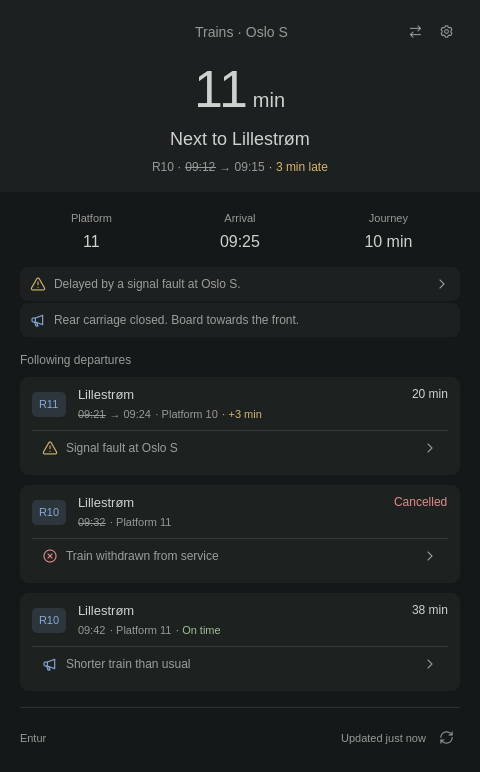

# Foamy Train

Direct trains in Norway, with live departures, delays, and service notices.



## Install

Requires Omarchy Quattro, Python 3.10 or newer, and GNU coreutils.
No API key is needed.

```sh
omarchy plugin add https://github.com/foamrider/foamy-train.git --enable
```

## Use

1. Open the settings cog and search for your **From** and **To** stations.
2. Select both results. Settings save automatically.
3. Use the arrows beside the cog to switch direction.

Left-click opens departures; right-click opens settings. Expand a service notice
for details. A yellow countdown means the train is delayed.

Settings include language, minutes in the bar, refresh interval, and an optional
weekly schedule. Outside the schedule, the widget dims or hides and stops fetching.
**Next (hours)** sets the search window from 1 to 24 hours (default 24). Only direct
trains are shown; longer countdowns use hours and minutes.

Your stations and preferences stay in Omarchy's `shell.json`. Station searches and
selected station IDs are sent to Entur. No account or location permission is needed.

## License

Data: [Entur](https://developer.entur.no/docs/open-services/journey-planner), NLOD.
Code: [MIT](LICENSE), with [Omarchy](LICENSE-OMARCHY) and [Lucide](LICENSE-LUCIDE) notices.

Provided **as is**, without warranty or guaranteed support. Use at your own risk.
